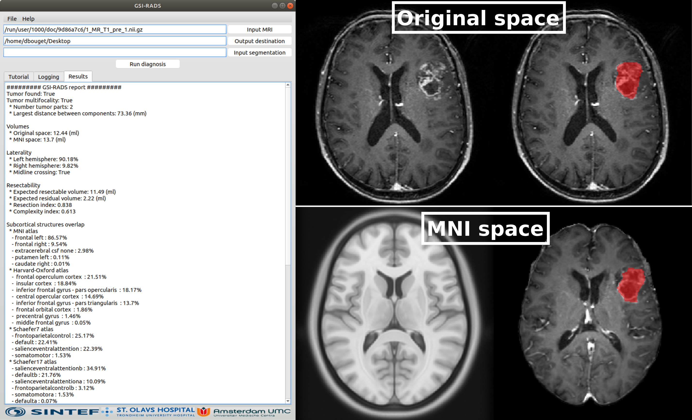

# Glioblastoma Surgery Imaging - Reporting And Data System (GSI-RADS)

[](https://github.com/DAVFoundation/captain-n3m0/blob/master/LICENSE)
[](https://github.com/SINTEFMedtek/GSI-RADS/releases)



## 1. Description
The repository contains the software to automatically compute glioblastoma's features from a T1-wighted MRI pre-operative MRI,
and report them in a standardized manner.

The software was introduced in the published article "Glioblastoma Surgery Imaging—Reporting and Data System: Standardized Reporting of Tumor Volume, Location, and Resectability Based on Automated Segmentations", of which the article is open access and can be downloaded from here: https://www.mdpi.com/2072-6694/13/12/2854

Please, cite the following article if you have used our software in one of your studies:
```
@ARTICLE{cancers13122854,
AUTHOR = {Kommers, Ivar and Bouget, David and Pedersen, André and Eijgelaar, Roelant S. and Ardon, Hilko and Barkhof, Frederik and Bello, Lorenzo and Berger, Mitchel S. and Conti Nibali, Marco and Furtner, Julia and Fyllingen, Even H. and Hervey-Jumper, Shawn and Idema, Albert J. S. and Kiesel, Barbara and Kloet, Alfred and Mandonnet, Emmanuel and Müller, Domenique M. J. and Robe, Pierre A. and Rossi, Marco and Sagberg, Lisa M. and Sciortino, Tommaso and van den Brink, Wimar A. and Wagemakers, Michiel and Widhalm, Georg and Witte, Marnix G. and Zwinderman, Aeilko H. and Reinertsen, Ingerid and Solheim, Ole and De Witt Hamer, Philip C.},
TITLE = {Glioblastoma Surgery Imaging—Reporting and Data System: Standardized Reporting of Tumor Volume, Location, and Resectability Based on Automated Segmentations},
JOURNAL = {Cancers},
VOLUME = {13},
YEAR = {2021},
NUMBER = {12},
ARTICLE-NUMBER = {2854},
URL = {https://www.mdpi.com/2072-6694/13/12/2854},
ISSN = {2072-6694},
DOI = {10.3390/cancers13122854}}
```

## 2. Softwares and usage
An executable is provided for the three main Operating Systems: Windows 10 (64-bit), macOS (>= High Sierra), and Ubuntu Linux 18.04.
The software can be downloaded from [here](https://github.com/SINTEFMedtek/GSI-RADS/releases) (see **Assets**). 

### 2.1 Download and installation  
These steps are only needed to do once:
1) Download the executable to your Operating System.  
2) On macOS/Ubuntu only: Open terminal, write `chmod +x `, drag and drop the file into the terminal window, and click Enter, to enable running program as executable.
3) Right-click and open to execute the file named GSI-RADS.

Then for all future use, simply double-click to launch the software.

**GSI-RADS might take up to a minute to start.** This is because the software has to be unpackaged at runtime. Some operating systems run an anti-virus check when unpackaging content. On Windows this is called **real-time protection**. This further slows down the unpackaging process. We will look into how to solve this issue in the near future.

The software may appear unresponsive when running analysis.

### 2.2 Usage  
  1) Click 'Input MRI...' to select from your file explorer the MRI scan to process (unique file).  
  1*) Alternatively, Click 'File > Import DICOM...' if you wish to process an MRI scan as a DICOM sequence.  
  2) Click 'Output destination' to choose a directory where to save the results.  
  3) (OPTIONAL) Click 'Input segmentation' to choose a tumor segmentation mask file, if nothing is provided the internal model with generate the segmentation automatically.  
  4) Click 'Run diagnosis' to perform the analysis. The human-readable version of the results will be displayed directly in the interface.  
  
  NOTE: The output folder is populated automatically with the following:  
       * The diagnosis results in human-readable text (report.txt) and Excel-ready format (report.csv).  
       * The automatic segmentation masks of the brain and the tumor in the original patient space (input_brain_mask.nii.gz and input_tumor_mask.nii.gz).  
       * The anatomical structures mask in original patient space (input_anatomical_regions_mask.nii.gz).  
       * The input volume and tumor segmentation mask in MNI space in the sub-directory named \'registration\'.  


## 3. Computed features  
The following features are automatically computed and reported to the user:
- **Multifocality**: whether the tumor is multifocal or not, the total number of foci, and the largest minimum distance between two foci.  
- **Volume**: total tumor volume in original patient space and MNI space (in ml).  
- **Laterality**: tumor percentage in each hemisphere, and assessment of midline crossing.  
- **Resectability**: expected resectbale and residual volumes (in ml), and resection index.  
- **Subcortical structures**: percentage of the tumor volume overlapping each structure from the MNI atlas, the Hard-Oxford atlas, and Schaefer atlas.  
- **White matter tracts**: percentage of the tumor volume overlapping each tract from the BrainLab atlas. If no overlap, the minimum distance to the tract is provided (in mm).  
