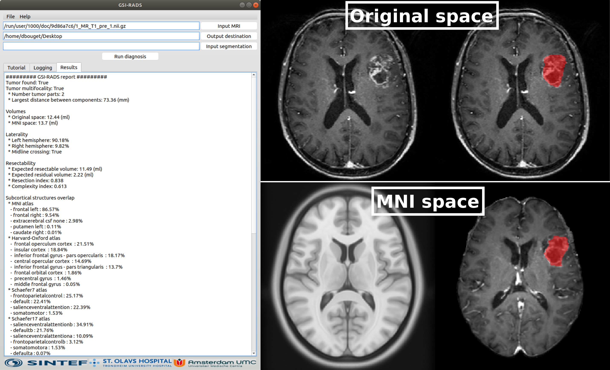

# Glioblastoma Surgery Imaging - Reporting And Data System (GSI-RADS)

[](https://github.com/DAVFoundation/captain-n3m0/blob/master/LICENSE)
[](https://github.com/SINTEFMedtek/GSI-RADS/releases)
[](https://doi.org/10.3390/cancers13122854)

⚠️***DEPRECATED: This project has been merged into [Raidionics](https://github.com/dbouget/Raidionics), and will no longer be actively maintained. Please, use Raidionics instead.***



## 1. Description
The repository contains the software to automatically compute glioblastoma's features from a T1-wighted MRI pre-operative MRI,
and report them in a standardized manner.

The software was introduced in the published article "Glioblastoma Surgery Imaging—Reporting and Data System: Standardized Reporting of Tumor Volume, Location, and Resectability Based on Automated Segmentations", of which the article is open access and can be downloaded from here: https://www.mdpi.com/2072-6694/13/12/2854

An in-depth technical desciption of the software and validation study on the segmentation performance, was presented in the published article "Glioblastoma Surgery Imaging-Reporting and Data System: Validation and Performance of the Automated Segmentation Task", and is made open access here: https://www.mdpi.com/2072-6694/13/18/4674

The manual segmentation data can be found as a publicly archived dataset (https://doi.org/10.17026/dans-xam-j5aw). The data and statistics code for analysis can be found as a public archive (https://gitlab.com/picture/gsi-rads).

## 2. Softwares and usage
An installer is provided for the three main Operating Systems: Windows (v10, 64-bit), macOS (>= High Sierra), and Ubuntu Linux (>= 18.04).
The software can be downloaded from [here](https://github.com/SINTEFMedtek/GSI-RADS/releases) (see **Assets**). 

### 2.1 Download and installation
These steps are only needed to do once:
1) Download the installer to your Operating System.
2) Right click the downloaded file, click "open", and follow the instructions to install.
3) Search for the software "GSI-RADS" and double click to run.

On **macOS** the software may be slow to start **the first time**, due to the firewall checking the software. Otherwise, the GUI should pop up instantly.
On **Windows** and **Ubuntu Linux** the software may be slow to start as it needs to unpackage the software every time. This has been solved for macOS and will be solved for the two other operating sytems in the near future.

### 2.2 Usage  
  1) Click 'Input MRI...' to select from your file explorer the MRI scan to process (unique file).  
  1*) Alternatively, Click 'File > Import DICOM...' if you wish to process an MRI scan as a DICOM sequence.  
  2) Click 'Output destination' to choose a directory where to save the results.  
  3) (OPTIONAL) Click 'Input segmentation' to choose a tumor segmentation mask file, if nothing is provided the internal model with generate the segmentation automatically.  
  4) Click 'Run diagnosis' to perform the analysis. The human-readable version of the results will be displayed directly in the interface.  
  
  NOTE: The output folder is populated automatically with the following:  
       * The diagnosis results in human-readable text (report.txt) and Excel-ready format (report.csv).  
       * The automatic segmentation masks of the brain and the tumor in the original patient space (input_brain_mask.nii.gz and input_tumor_mask.nii.gz).  
       * The cortical structures mask in original patient space for the different atlases used.  
       * The input volume and tumor segmentation mask in MNI space in the sub-directory named \'registration\'.  

### 2.3 Computed features  
The following features are automatically computed and reported to the user:
- **Multifocality**: whether the tumor is multifocal or not, the total number of foci, and the largest minimum distance between two foci.  
- **Volume**: total tumor volume in original patient space and MNI space (in ml).  
- **Laterality**: tumor percentage in each hemisphere, and assessment of midline crossing.  
- **Resectability**: expected residual volumes (in ml) and resection index.  
- **Cortical structures**: percentage of the tumor volume overlapping each structure from the MNI atlas, the Harvard-Oxford atlas, and Schaefer atlas (version 7 and 17).  
- **Subcortical structures**: percentage of the tumor volume overlapping each structure from the BCB atlas. If no overlap, the minimum distance to the structure is provided (in mm).  

## 3. Source code usage

### 3.1 Installation
Use the requirements.txt file to create a virtual environment with the required libraries.
> virtualenv -p python3 venv  
> cd venv    
> source bin/activate  
> pip install -r ../requirements.txt  
> deactivate  

Then, to download the trained models locally, run the following:
> source venv/bin/activate  
> python setup.py  
> deactivate  

### 3.2 Usage
The command line input parameters are:
* -g [--use_gui]: Must be set to 0 to disable the gui, otherwise 1.
* -i [--input_filename]: Complete path to the MRI volume to process.
* (optional) -s [--input_tumor_segmentation_filename]: Complete path to the corresponding tumor mask, to avoid re-segmentation.
* -o [--output_folder]: Main destination directory. A unique timestamped folder will be created inside for each run.
* -d [--gpu_id]: Number of the GPU to use for the segmentation task. Set the value to -1 to run on CPU.

To run directly from command line, without the use of the GUI, run the following:
> source venv/bin/activate  
> python main.py -g 0 -i /path/to/volume/T1.nii.gz -o /path/to/output/ -d 0  
> deactivate

## 4. Citation policy
Please, cite the following two articles if you have used our software in one of your studies:
```
@ARTICLE{cancers13122854,
AUTHOR = {Kommers, Ivar and Bouget, David and Pedersen, André and Eijgelaar, Roelant S. and Ardon, Hilko and Barkhof, Frederik and Bello, Lorenzo and Berger, Mitchel S. and Conti Nibali, Marco and Furtner, Julia and Fyllingen, Even H. and Hervey-Jumper, Shawn and Idema, Albert J. S. and Kiesel, Barbara and Kloet, Alfred and Mandonnet, Emmanuel and Müller, Domenique M. J. and Robe, Pierre A. and Rossi, Marco and Sagberg, Lisa M. and Sciortino, Tommaso and van den Brink, Wimar A. and Wagemakers, Michiel and Widhalm, Georg and Witte, Marnix G. and Zwinderman, Aeilko H. and Reinertsen, Ingerid and Solheim, Ole and De Witt Hamer, Philip C.},
TITLE = {Glioblastoma Surgery Imaging—Reporting and Data System: Standardized Reporting of Tumor Volume, Location, and Resectability Based on Automated Segmentations},
JOURNAL = {Cancers},
VOLUME = {13},
YEAR = {2021},
NUMBER = {12},
ARTICLE-NUMBER = {2854},
URL = {https://www.mdpi.com/2072-6694/13/12/2854},
ISSN = {2072-6694},
DOI = {10.3390/cancers13122854}}
```

```
@ARTICLE{cancers13184674,
AUTHOR = {Bouget, David and Eijgelaar, Roelant S. and Pedersen, André and Kommers, Ivar and Ardon, Hilko and Barkhof, Frederik and Bello, Lorenzo and Berger, Mitchel S. and Nibali, Marco Conti and Furtner, Julia and Fyllingen, Even Hovig and Hervey-Jumper, Shawn and Idema, Albert J. S. and Kiesel, Barbara and Kloet, Alfred and Mandonnet, Emmanuel and Müller, Domenique M. J. and Robe, Pierre A. and Rossi, Marco and Sagberg, Lisa M. and Sciortino, Tommaso and Van den Brink, Wimar A. and Wagemakers, Michiel and Widhalm, Georg and Witte, Marnix G. and Zwinderman, Aeilko H. and Reinertsen, Ingerid and De Witt Hamer, Philip C. and Solheim, Ole},
TITLE = {Glioblastoma Surgery Imaging–Reporting and Data System: Validation and Performance of the Automated Segmentation Task},
JOURNAL = {Cancers},
VOLUME = {13},
YEAR = {2021},
NUMBER = {18},
ARTICLE-NUMBER = {4674},
URL = {https://www.mdpi.com/2072-6694/13/18/4674},
ISSN = {2072-6694},
ABSTRACT = {For patients with presumed glioblastoma, essential tumor characteristics are determined from preoperative MR images to optimize the treatment strategy. This procedure is time-consuming and subjective, if performed by crude eyeballing or manually. The standardized GSI-RADS aims to provide neurosurgeons with automatic tumor segmentations to extract tumor features rapidly and objectively. In this study, we improved automatic tumor segmentation and compared the agreement with manual raters, describe the technical details of the different components of GSI-RADS, and determined their speed. Two recent neural network architectures were considered for the segmentation task: nnU-Net and AGU-Net. Two preprocessing schemes were introduced to investigate the tradeoff between performance and processing speed. A summarized description of the tumor feature extraction and standardized reporting process is included. The trained architectures for automatic segmentation and the code for computing the standardized report are distributed as open-source and as open-access software. Validation studies were performed on a dataset of 1594 gadolinium-enhanced T1-weighted MRI volumes from 13 hospitals and 293 T1-weighted MRI volumes from the BraTS challenge. The glioblastoma tumor core segmentation reached a Dice score slightly below 90%, a patientwise F1-score close to 99%, and a 95th percentile Hausdorff distance slightly below 4.0 mm on average with either architecture and the heavy preprocessing scheme. A patient MRI volume can be segmented in less than one minute, and a standardized report can be generated in up to five minutes. The proposed GSI-RADS software showed robust performance on a large collection of MRI volumes from various hospitals and generated results within a reasonable runtime.},
DOI = {10.3390/cancers13184674}}
```


